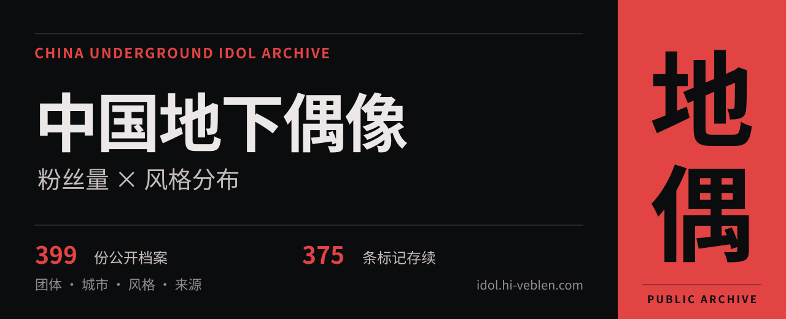
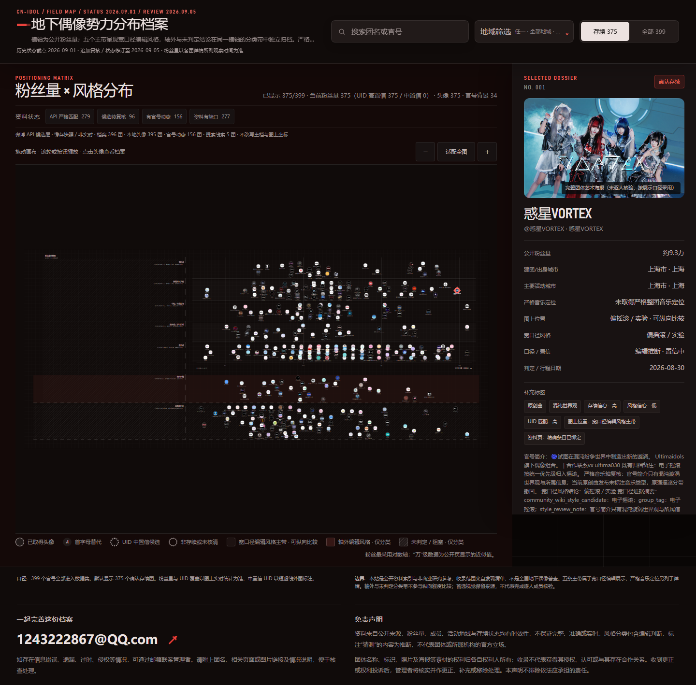

[](https://idol.hi-veblen.com/)

# 中国地下偶像档案

把散落在官号、公开博文和 Wiki 中的团体资料放进同一张图：从粉丝量与风格分布出发，按城市寻找团体，沿着来源逐条查阅。

**[进入在线档案 →](https://idol.hi-veblen.com/)** · [读图说明](#读图之前) · [本地运行](#本地运行) · [联系与更正](#联系与更正)

| 收录条目 | 当前标记为存续 | 历史存续状态截点 | 展示证据复核截至 |
| :------- | :------------- | :--------------- | :--------------- |
| **399**  | **375**        | 2026-09-01       | 2026-09-05       |

这些数字对应本项目收录的归档样本，以团体为主，事务所或企划类条目会在详情中说明。粉丝量以各条目详情中的观察时间为准，团体状态与成员阵容也可能在截点之后发生变化。

2026-09-05 追加状态修订：根据用户确认，@Lumina微光 已注销，现列为解散团。该修订已计入当前存续数，2026-09-01 的历史截点保留。

## 在图上寻找团体

[](https://idol.hi-veblen.com/)

- **搜索与浏览**：输入团名或官号定位团体，缩放、移动分布图，点击头像打开详情。
- **按地域查找**：在建团城市、主要活动城市两种口径间切换，支持省份与城市混选，地域条件按并集显示。
- **按资料状态筛选**：默认显示确认存续团体，可切换至全部样本，也可按页面提供的资料状态继续筛选。
- **回到资料来源**：详情保留公开粉丝量、风格依据、图像来源，以及可用的微博与 China Idols Wiki 链接；待核实内容会显示相应提示。

## 读图之前

| 图上的位置或标记         | 应当如何理解                                                                                 |
| :----------------------- | :------------------------------------------------------------------------------------------- |
| 横轴：公开粉丝量         | 采用对数尺度，越向右粉丝量越多。公开页以“万”等单位显示的数值是近似值；未知值放在独立区域。   |
| 五个风格主带             | 呈现宽口径编辑分类，越向上越偏摇滚，越向下越偏王道。它用于观察分布，不能视作精确的音乐测量。 |
| 轴外、未判定与阻塞分类带 | 只作分类，带内纵向位置不表示程度，未判定也不代表中性风格。                                   |
| 风格猜测与证据状态       | 推断会标注“（猜测）”等提示，证据不足时保留未判定。严格音乐定位与依据另列在团体详情中。       |
| 头像、封面与团体视觉     | 按各自来源和展示口径采用。团体图像不一定是当前完整成员阵容，是否完成核验以详情标注为准。     |

粉丝量不能直接代表现场人气、演出质量、艺术价值或商业估值。本项目是发现清单的归档样本，收录范围不等同于全国地下偶像普查。

## 资料从哪里来

资料来自公开官号、公开博文、China Idols Wiki 及人工复核。每项结论应结合对应的来源、观察时间与证据状态阅读；候选线索也会与已采用的展示信息区分。

仓库保留页面使用的公开数据与素材，便于查看资料和复现页面：

| 文件或目录                                                           | 内容                                 |
| :------------------------------------------------------------------- | :----------------------------------- |
| [`index.html`](index.html)、[`app.css`](app.css)、[`app.js`](app.js) | 静态页面、样式与交互逻辑             |
| [`data.js`](data.js)                                                 | 浏览器直接加载的数据包               |
| [`data/群体分布数据.json`](data/群体分布数据.json)                   | 规范化历史快照，不覆盖后续修订       |
| [`data/公开补充复核.json`](data/公开补充复核.json)                   | 后续账号、企划身份与用户确认状态修订 |
| [`data/编辑展示覆盖数据.json`](data/编辑展示覆盖数据.json)           | 编辑展示补充与覆盖数据               |
| [`data/微博候选证据展示层.json`](data/微博候选证据展示层.json)       | 微博候选资料与证据摘要               |
| [`assets/`](assets/)                                                 | 页面使用的图像素材                   |
| [`tests/`](tests/)                                                   | 页面可访问性与交互约定检查           |

公开版本不包含内部 API 原始响应缓存、计费记录、采集工具、内部采集测试夹具及未被页面引用的候选素材。页面中的候选证据来自已保存的快照，访问站点不会实时调用微博或 Wiki 接口。

## 本地运行

下载包含全部已生成脚本的发布版本后，用浏览器打开 [`discover.html`](discover.html) 开始发现，或从 [`index.html`](index.html) 进入原风格图。所有页面使用相对链接和普通脚本，支持 file:// 与静态 HTTP/HTTPS，访问者无需 Node.js。

开发或编辑资料需要 Node.js 22.14.0 或受支持的更新版本。在仓库目录运行：

```sh
npm ci
npm run verify
npm run preview
```

`verify` 依次运行 TypeScript strict、ESLint、Prettier、esbuild IIFE 构建和全部旧/新测试。`npm test` 仍保留页面可访问性、公开补充资料与历史隔离以及原脚本语法检查，不刷新数据。`preview` 仅监听本机 127.0.0.1:4174，按 Ctrl+C 停止。

页面主导航为发现、团体、演出、风格图与观演指南，页脚保留邮件投稿纠错和关于入口。团体列表与独立档案使用轻量公开索引；`group.html?group=g001` 进入独立档案，旧 `index.html?group=g001` 仍可定位原图表。完整399条保留，历史条目可从全部档案访问。演出默认显示今天及未来的已收录资料，`period=past|all` 可看往期或全部，旧日期查询和活动锚点继续可用。活动为人工核验的部分收录，非实时全国排期；“尚未收录”不代表没有活动。

纠错入口允许 `group`、`event`、`page`、`kind` 四类公开标识，预填内容可见且可编辑；未知、重复、过长或不合法参数回退至手动填写。页面只生成邮件草稿，由用户检查并发送。离线访问不会把本机文件地址写入草稿。

修改 TypeScript 或活动 JSON 后执行 `npm run build` 更新普通脚本。参数、数据与时态契约见 [活动维护说明](docs/EVENTS.md)。构建配置参考 [TypeScript strict](https://www.typescriptlang.org/tsconfig/strict.html)、[esbuild IIFE](https://esbuild.github.io/api/#iife)、[typescript-eslint](https://typescript-eslint.io/getting-started/) 和 [Prettier CLI](https://prettier.io/docs/cli)。

`npm run package:site` 完成验证后生成 `.build/site` 及 SHA-256 文件清单。该目录仅含页面、样式、普通脚本与白名单图像，不包含开发环境、Git、私有缓存或收据。此命令只生成本地候选；备案展示、站长确认及独立验收是公开发布前另行完成的步骤。

在线站点由自有服务器上的 Nginx 托管，GitHub 用于保存公开发布源码。

资料维护流程与建议更新节奏见[更新说明](docs/UPDATING.md)。当前尚未启用自动调度。

## 联系与更正

管理者邮箱：**[1243222867@QQ.com](mailto:1243222867@QQ.com)**

如果发现信息错误、遗漏、过时、来源标注问题，或认为收录内容涉及侵权，可邮件联系管理者，提出补充、更正或移除请求。来信请尽量附上团名、相关页面或素材链接、具体问题及可核实的依据，便于定位与处理；一般资料问题也可通过本仓库的 Issues 反馈。

## 免责声明与素材权利

本项目是非官方、非商业的研究资料与索引，可供资料查阅和企划参考，不代表所收录团体、运营方、平台或 Wiki 的立场。资料由公开来源整理，不保证实时、完整或准确；用于转载、研究引用或实际决策前，请向对应官号与原始来源核实。

头像、海报、微博背景、Wiki 团体图及其他第三方素材的权利归原发布方或相应权利人所有。公开可访问不等于获得转载或商用授权，本仓库不对第三方素材另行授权。涉及权利争议或希望更正来源、更新资料、移除素材，请通过上述邮箱联系管理者。
